# 核心架构

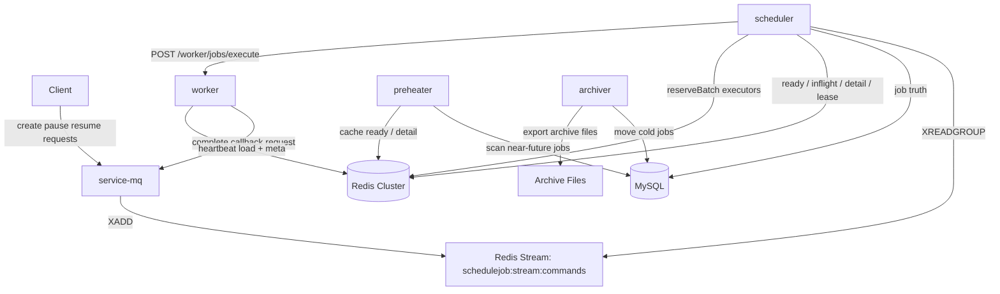

项目最大的特点在于：
1.使用redis stream作为消息队列存储用户请求，提高请求入口负载，由多scheduler前往消息队列共同消费请求
2.支持用户自定义预约任意的到期时间，系统能在精准地在到期时间进行任务派发执行
3.scheduler对任务的控制粒度十分精细，它是业务预约级别的任务调度器，它对用户的每一条预约都进行了控制，提供创建/获取/暂停/恢复功能，并对任务的执行提供超时/重试/失败/回调功能，保证任务的可靠性。
4.预热器将近未来任务提前写到redis，多scheduler进行任务派发，一方面可以一次性扫描出更多的任务，减少对mysql的全表扫描，另一方面由于已经预热到了redis，且使用多scheduler+多redis结点处理近未来的任务，并行处理对任务的控制（scheduler提供的是控制，不是执行），减少任务派发的时延，同时，任务派发之后由ready->inflight，任务的运行中间态由redis维护，不需要扫描DB进行超时重试，直接从inflight requeue到ready，加快速度。
5.系统能够承载的是大规模的任务，但是对于单条的任务来说不会存在高并发，因此对于任务的操作都尽可能会在redis中进行操作
6.对任务进行归档，预热扫描只会扫描未完成的任务，实现冷热库的分离，提高速度
7.通过redis实现对worker集群的负载均衡，将任务派发给负载最轻的worker，提高完成任务的性能，同时，在派发时使用线程池调用远程服务，防止派发任务的主线程阻塞。
8.提供了高可用性，scheduler实例和worker实例都实时注册在redis中，一台scheduler宕机后会有lease机制重新将shard分给存活scheduelr，一台worker实例宕机scheduler会将任务的执行负载均衡到其他的worker，redis又设置了主从

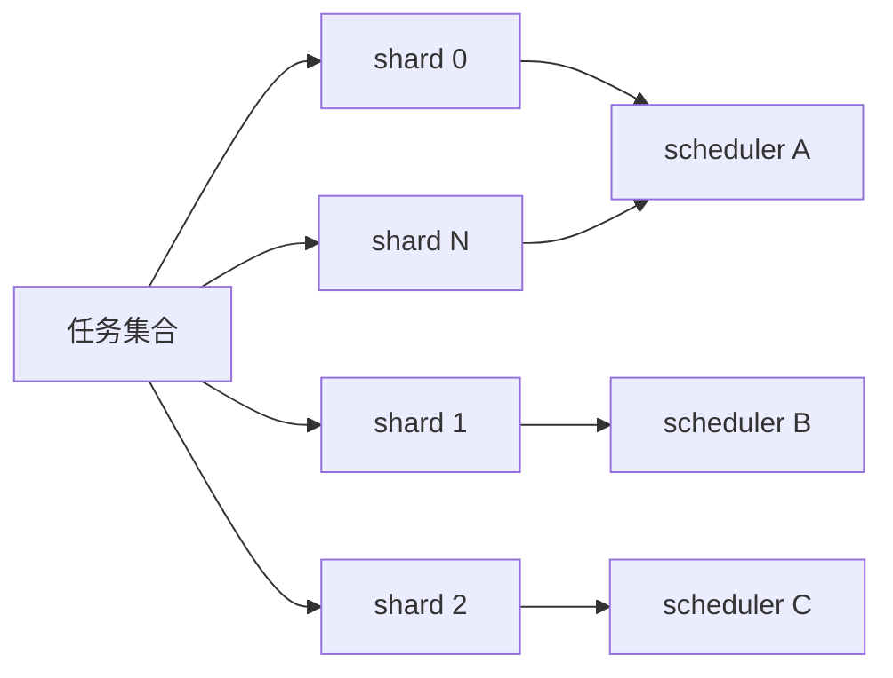

**用shard拆分key的作用有两个，一是防止大key生成，二是使得有机会使用多redis结点并行处理任务**：逻辑分片是用 64 个 shard 用来把任务分散到 64 个逻辑桶里，物理分片是用使用多个Redis结点分摊这些逻辑桶。通过 hash tag 花括号{shard} 能保证将相关的key放在同一个slot上，方便用lua原子操作它们。实际上，将任务分到不同的redis shard上，可以让这些任务不会聚焦到同个key，从而有机会能够让任务处于不同的redis结点上，能够并行去执行，但是，这样仍然不能保证任务会负载均衡到redis的各个结点，因为集群实际上是通过CRC16(tag) % 16384分到slot中，每个node拥有一部分的slot，有可能最后算出的CRC16(tag) % 16384全都分到了同一个node的slot中，因此，解决办法有两个，一是扩大shard数量，既增加分散概率又防止大key产生，二是使用专门设计过的tag，让所有tag经过CRC16(tag) % 16384 的值最后能够均匀分布。

每个逻辑桶在同一时刻只能由一个scheduler实例去操作，用键schedulejob:lease:{shard} 值ownerId 进行标识。抢占成功后scheduler实例需要定期续租，实例挂掉则lease到期，其他实例会接管这些shard。

# 模块职责

1. **mq**：

   1. 接收外部写请求
   2. 把请求序列化成命令写入 Redis Stream
   3. 返回“已接收”响应和 `streamRecordId

   **preheater**：

   1. 周期扫描 MySQL 中进入近未来窗口且 `hot_cached=0` 的任务
   2. 把这些任务写入 Redis `ready/detail`

   **scheduler**：

   1. 多线程消费 Redis Stream 中的命令
   2. 创建任务并写入 `sj_job`
   3. 对热任务做“创建即预热”
   4. 通过 shard lease 管理多 scheduler 的分工
   5. 从 `ready` claim 到期任务到 `inflight`
   6. 批量 reserve worker 执行容量
   7. 线程池异步分发任务给 worker
   8. 接收 worker 回调，更新任务状态
   9. 处理暂停、恢复和执行完成回调

   **worker**：

   1. 定时把 `nodeCode / host / currentLoad / maxLoad / lastHeartbeatMillis` 写入 Redis
   2. 接收 scheduler 派发的任务
   3. 在本地线程池异步执行
   4. 执行完成后回调 mq

   **archiver**：

   1. 扫描热表中的冷任务
   2. 把 `DISPATCHED / FAILED` 且超过归档窗口的任务迁移到 `sj_job_archive`
   3. 为归档任务补写 JSON 文件

   **model**：

   1. 共享`CreateJobRequest`、`WorkerExecuteRequest`、`WorkerExecuteResponse`、`JobExecutionCallbackRequest`、`JobCommandMessage / JobCommandType`、Redis key 常量、通用返回模型 `R`

# 写链路

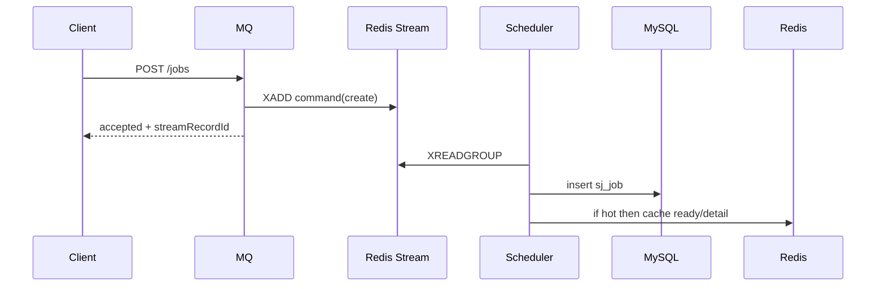

暂停、恢复、完成回调也走同一条命令队列。

用户通过/jobs/**向mq模块提交请求，redis中通过stream结构存储消息key为 "schedulejob:stream:commands" ，键为{commandType、jobId、creatorId、bodyJson、publishedAt}，其中bodyJson为请求详情，通过ObjectMapper.writeValueAsString(request) 进行序列化，读取时通过ObjectMapper.readValue(command.getBodyJson(), Type.class)反序列化

消费请求由scheduler实现，在start方法上添加@PostConstruct注解，在Bean初始化完成后立即自动执行一次，这个方法的作用是为stream创建一个消费组，以及新建一个线程池。每个线程都是一个消费者，消费者名字为InstanceId+"-command-" + index。ThreadPoolExecutor.submit(() -> consumeLoop(consumerName)))。在stop方法上添加@PreDestroy注解，在Bean销毁前执行Executor.shutdownNow()

consumeLoop的流程是：
1.先跑一次 recoverPendingList(consumerName) ，对pendingList中的record进行handleRecord
2.进入 while (running) 循环 ，用 XREADGROUP 拉新消息，消息被拉取后会放在pendingList
3.逐条调用 handleRecord，根据record的commandType，调用scheduleJobService相应的方法，确认消息

```java
//stream存储请求消息
MapRecord<String, String, String> record = StreamRecords.mapBacked(values).withStreamKey(mqProperties.getStreamKey());//创建消息
RecordId recordId = stringRedisTemplate.opsForStream().add(record);//存储消息
```

```java
//start方法创建消费者组和线程池
stringRedisTemplate.opsForStream().createGroup(streamKey, ReadOffset.latest(), groupName);//为stream创建消费组
ExecutorService commandConsumerExecutor = new ThreadPoolExecutor(threadCount,threadCount,0L,TimeUnit.MILLISECONDS,new LinkedBlockingQueue<>(),new CommandConsumerThreadFactory());//线程池配置为最大线程数=核心线程数，队列为阻塞队列，线程池工厂通过AtomicInteger.getAndIncrement()设置不重复的线程名字，这里的线程名是给JVM内部看的，而redis中记录的消费者名字跟这个不同
```

```java
//consumeLoop - 消费while循环部分
List<MapRecord<String, Object, Object>> records = stringRedisTemplate.opsForStream().read(
	Consumer.from(properties.getCommandConsumerGroup(), consumerName),           StreamReadOptions.empty().count(readBatchSize).block(Duration.ofMillis(readBlockTimeoutMs)),
StreamOffset.create(properties.getCommandStreamKey(), ReadOffset.lastConsumed())
); //lastConsumed()即redis的">",表示拉取没处理过的新消息
for (MapRecord<String, Object, Object> record : records) {
     handleRecord(record);
}//while循环中使用try-catch，出异常就调用revocerPendingList
```

```java
//revocerPendingList
List<MapRecord<String, Object, Object>> records = stringRedisTemplate.opsForStream().read(
	Consumer.from(properties.getCommandConsumerGroup(), consumerName),
	StreamReadOptions.empty().count(commandReadBatchSize),
	StreamOffset.create(commandStreamKey(), ReadOffset.from("0"))
);//ReadOffset.from("0")表示从第0条消息开始读，处理积压的历史消息
```

# 调度主链

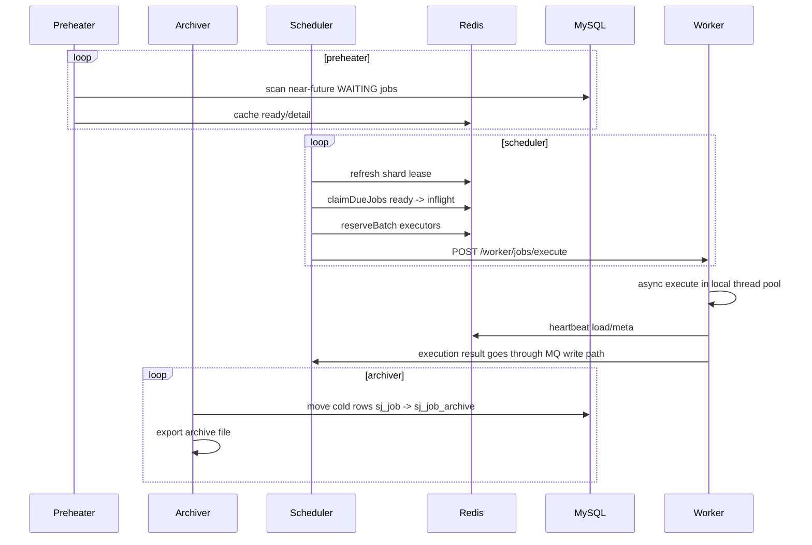

scheduler 把任务写入mysql，并将近未来任务直接预热到Redis 分片队列；preheater定时将近未来任务预热到redis中；多个 scheduler 通过 lease 机制动态划分shard，定时扫描 shard，原子 claim 真正可执行任务；loadbalance选择一个worker 执行；worker完成后回调 scheduler，scheduler 更新任务状态并释放节点负载；任务每天进行一次归档，将已经结束的任务放到归档冷表。

## 创建任务

scheduler 为任务生成 `shardKey`，然后把任务主记录写进 MySQL 的 `sj_job`，status为 `WAITING`；如果任务属于近未来窗口，会继续预热进对应的 Redis shard queue（预热器也会做这个事）
**将mysql任务预热到redis由预热器preheater执行**：扫描数据库中所有近未来任务（now-1,now+preheatminutes），将它们缓预热到shard中并标记HotCached=1。由于存在任务加载到redis后，redis宕机的情况存在，因此设置定时任务进行热任务对账，将HotCached=1、不存在于ready/inflight队列的任务补充进去。系统提供任务不丢失可靠性，保证任务至少执行一次。
**任务属于哪个shard**：通过 `Math.floorMod(shardKey.hashCode(), properties.getShardCount())` 计算 shard 编号，后续预热、claim、woker超时重试 都通过这个计算定位到同一个 Redis shard
**任务存入redis shard**：在redis中存入Hash结构，键schedulejob:{shard}:detail，值{任务id，任务详情}，以及存入ZSet结构，键schedulejob:{shard}:ready，score执行毫秒时间戳，member任务id，其中花括号{shard}能够让相关的结构都放在同一个slot中

## shard归属

由lease机制动态为存活的实例分配lease，实例只会管理对应的shard，分派shard中的任务。
**实例的标识**：每个微服务实例都有ScheduleJobServiceImpl，在该类中声明属性instanceId，值为配置文件中的 instance-id: ${SCHEDULEJOB_INSTANCE_ID:}，在启动时指定参数值，没指定则随机生成"scheduler-" + InetAddress.getLocalHost().getHostName() + "-" +UUID.randomUUID().toString().substring(0, 8); 该类中还有属性remoteClient、executor任务分发线程池、ownedShards拥有的shard集合Set\<Integer\> ownedShards = ConcurrentHashMap.newKeySet() 注意这里使用了并发安全集合、callbackbaseurl等
**shard属于哪个实例由定时任务refreshShardLease执行**：执行refreshShardLeases方法时，在ZSet中添加当前scheduler实例，键为"schedulejob:scheduler:members"，score为scheduler有效期，member为instanceId，然后根据score移除过期的实例，接下去获取所有活跃的实例，需要对它们进行排序（所有 scheduler 都必须基于同一份顺序算 shard 分工，否则每台机器算出来会不一致），将所有shard按照轮询分配给所有活跃实例，不过只是理论上的分配，每个scheduler实例都在refreshShardLeases方法创建一个Set desiredShards，if (instanceId.equals(activeMembers.get(shard % memberCount))) { desiredShards.add(shard);}，之后实例要真正尝试租赁/续租这些desiredShards，key为schedulejob:lease:+shard，value为instanceId，若shard还暂时在别人手里是不会抢占的，通过lua脚本执行redis.call('PEXPIRE', key, ttl)续租，local created = redis.call('SET', key, owner, 'NX', 'PX', ttl)尝试租赁，对于租赁/续租成功的shard会添加到实例的Set ownedShards中，同时会移除掉这一轮理论上不该由自己管理的shard（redis和ownedShards中都要移除，移除后可能有些shard会暂时无人管理，需要等到下一轮refreshShardLeases再分配）

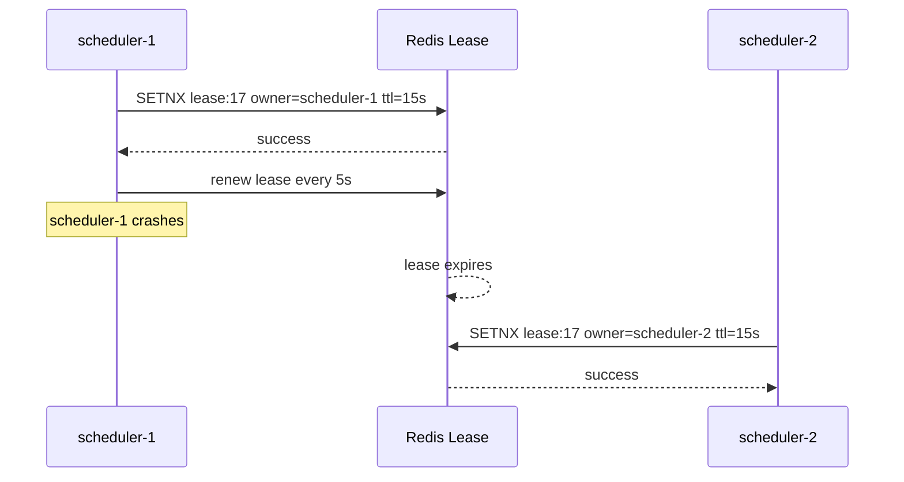

## 分派任务

scheduler扫描相应的shard -> 从 shard ready 队列里找“已经到时间的任务” -> 用一次原子 claim 把这些任务批量从ready 挪到 inflight ，并根据shard detail返回这些任务的详情 -> 交给本机的分发线程池处理。infilght的作用是对worker的超时重试，但这个状态不写回DB，运行时中间态交给 Redis

**派发shard中可执行任务由定时任务dispatchDueJobs执行，可以分为三个部分**：
**1.claim**：发起一条lua脚本，对ownedShards中每个shard调用lua脚本对任务进行claim，从 ZSet schedulejob:{shard}:ready 取出claimBatchSize条 score <= now 的id，不仅会移除并添加到 ZSet schedulejob:{shard}:inflight，score为claimDeadline，即nowMillis + properties.getClaimTimeoutMs()，还会从Hash  schedulejob:{shard}:detail中查询任务详情，返回List\<ScheduleJobSnapshot\>，对所有shard执行一遍lua脚本，就能得到所有claim的任务详情
2.**选点**：worker维护host和maxLoad，redis中维护存活 ZSet schedulejob:executor:alive，score为存活时间，member为host， 负载比例ZSet schedulejob:executor:load，score为当前负载比例, member为host，一次负载占用HASH schedulejob:executor:loadstep，值为{host，每个节点的 1/maxLoad}
选点时会发起一条lua脚本，先根据executor:alive 删除心跳超时的host以及相关的负载信息，接下去从存活结点中根据executor:load挑选负载比例最小的结点，检查load+loadstep<1，是的话说明没有超载，更新负载并选取该结点，最后返回一批可执行的host结点。因为对于一些服务，它提供的接口一次只能处理一个job，无法批量封装job进行处理，每个job都要对应一个http请求，因此这里为每一个job返回一个对应的host，而且这样也可以精确控制负载。最后返回的host结点数m可能少于job总数m，因为有可能所有主机都满载了, 对于m>n的那部分任务，会重新入队，等待下个分派周期重试。
**3.派发**：通过线程池派发任务，先将当前的派发信息记录到detail，然后通过RestTemplate.postForObject("http://"+host+"/worker/jobs/execute", request, R.class)调用远程服务，调用和等待结果是scheduelr的线程，而真正执行任务的是worker的线程。不过，resttemplate的调用是同步阻塞的，会一直等到这次 HTTP 请求完成、超时或抛异常才返回。因此这里使用线程池，防止调用服务阻塞导致派发任务的主线程阻塞。因此现在就是派发任务不阻塞，而线程池需要同步阻塞等待结果，然后根据结果更新任务状态、清空缓存、释放负载。

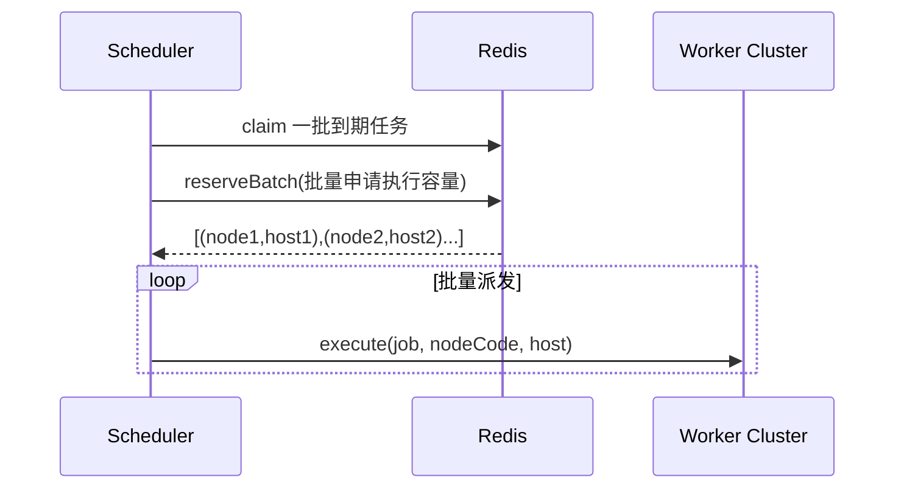

## 任务结束

scheduler派发任务线程不阻塞，线程池中调用服务的线程同步阻塞等待结果，然后根据结果更新任务状态、清空缓存、释放负载。
而当前worker demo实现为快速响应，异步更新任务状态、清空缓存、释放负载。
具体为：worker收到请求时调用线程池异步执行任务，并立即返回一个接收成功的响应，让scheduler的调用能立即得到接收成功的结果，不会继续阻塞，然后将更新任务状态、清空缓存、释放负载这些工作放在回调接口，让worker demo在真正将任务执行结束之后调用该接口。即回调RestTemplate.postForObject(callbackBaseUrl/jobs/{jobId}/complete,request,R.class)，
scheduler的completeJob方法会从request中拿shardKey，以及根据jobId 优先从redis Hash中获取任务详情，键schedulejob:{shard}:detail，值{任务id，任务详情} ，若获取不到再去mysql获取。根据request.getSuccess()，CAS更新任务的状态为Completed或Faild，释放redis 该任务相关信息，以及释放worker的负载。

## 重试机制

需要重试的场景如下：
1.在选点时，所有的host都已经满载，需要将超出负载的任务放回ready队列
2.派发线程池满了，拒绝策略是直接丢弃并抛出异常，派发主线程捕获异常并让任务重试
2.派发任务到worker时调度异常或worker没有接受
3.host心跳后，在redis的一个窗口时间内属于存活状态，但如果在窗口内host宕机了，这些请求仍然会发给它，需要等待inflight超时，重新将任务放到ready队列
4.任务执行结束但worker多次回调均失败了（worker会多次进行重试），需要等待inflight超时进行重试
5.任务claim后还没派发，scheduler就挂了，任务卡在inflight，等待超时重试

重试时，将任务从inflight移除，把下次执行时间设成 now + retryDelaySeconds ，然后放回ready队列
最多重试maxTryTimes，超出最大超时次数就会直接CAS更新任务状态为Faild，释放redis该任务相关信息。

重试+回调机制+mysql保证了任务一旦创建就至少会派发一次，由于中间状态全由redis维护，mysql只记录创造任务和结束任务，以及redis/scheduler可能中途宕机，种种情况就导致存在任务重复派发的问题，需要worker自己实现业务幂等（消息队列也是类似的，需要实现幂等），目前项目并没有接入具体业务，没有提供实现。

扫描shard中claim但未回调的任务由定时任务recoverTimedOutJobs执行：扫描当前实例的ownedShards，对于每一个shard，都从 ZSet schedulejob:{shard}:inflight中取出ScanBatchSize条 score<=now的任务，设置下次，重新添加到 ZSet schedulejob:{shard}:ready，返回操作了的任务列表。Redis 只是先回收，真正是不是该恢复还要看 MySQL。若mysql已经没有这条任务/任务状态不是CLAIMED或RUNNING 就清除Reids后退出，否则就进行恢复，修改状态为WAITING、执行时间为now，同时刷新一下redis中的detail

## 归档

`sj_job`：只保留在线调度需要的热数据和短期终态数据。

`sj_job_archive`：只保留归档后的冷数据，统一状态为 `ARCHIVED`。

**通过定时任务archive执行任务归档**：默认每天 02:00跑一次，将把热表 sj_job 里的冷任务搬到sj_job_archive，删掉热表的任务。将冷表中archive_path 为空的归档记录导出到NDJSON 文件，每天一个文件、每行一个任务 JSON，文件路径为 ${archiveDir}/yyyyMMdd/jobs.ndjson，导出时，先读当天可能已有的 jobs.ndjson文件，将每一行反序列化后合并到这次的待导出记录Map<Long, String> entries里，然后重写当天文件

```java
writeDailyArchiveFile(filePath, entries.values());

private void writeDailyArchiveFile(Path filePath, Iterable<String> lines) throws Exception {
        Path targetDir = filePath.getParent();
        Files.createDirectories(targetDir);
        Path tempPath = filePath.resolveSibling(filePath.getFileName() + ".tmp");
        try (BufferedWriter writer = Files.newBufferedWriter(tempPath, StandardCharsets.UTF_8)) {
            for (String line : lines) {
                writer.write(line);
                writer.newLine();
            }
        }
        Files.move(tempPath, filePath, StandardCopyOption.REPLACE_EXISTING);
    }
```

# 配置

**preheater**

  - 定时方式：fixedDelay，preheat-interval-ms=200
  - 预热窗口：now - 1 分钟 到 now + preheatMinutes，当前preheatMinutes=20
  - 每轮最多预热 20000条
  - 查库条件：只扫 WAITING and hot_cached=0 且落在窗口内的任务     如果预热进去但是没完成怎么办？！

**scheduler**

  -  分片数：128
  - Shard 心跳 ：每 2000ms 一次，成员ttl 6000ms，租约ttl6000ms
  - 派发定时：每 20ms 检查一次redis可执行任务
  - 派发线程池：core=128、max=256、queue=100000
  - claim：claim-batch-size=4000，claim-timeout-ms=60000，需要根据worker的耗时而定
  - inflight超时恢复：每 2000ms 一次
  - scan-batch-size=500
  - 下次重试延迟：3000ms
  - worker 心跳超时：15000ms
  - scheduler member TTL：15000ms，见 scheduler/src/main/resources/application.yml:47
  - member heartbeat 间隔：5000ms
  - lease TTL：15000ms
  - 命令流消费者：8 个线程，每次读 100 条，阻塞 500ms

# 启动

1. 初始化 和启动MySQL
2. 启动 Redis Cluster

```powershell
进入目录
cd F:\project\JavaProject\DevelopProject\scheduler-master\docs\redis-cluster
创建数据目录
New-Item -ItemType Directory -Force .\data\7001, .\data\7002, .\data\7003, .\data\7004, .\data\7005, .\data\7006 | Out-Null
启动redis节点
D:Memurai\memurai.exe .\redis-7001.conf
D:Memurai\memurai.exe .\redis-7002.conf
D:Memurai\memurai.exe .\redis-7003.conf
D:Memurai\memurai.exe .\redis-7004.conf
D:Memurai\memurai.exe .\redis-7005.conf
D:Memurai\memurai.exe .\redis-7006.conf
构建集群
D:\Memurai\memurai-cli.exe --cluster create 127.0.0.1:7001 127.0.0.1:7002 127.0.0.1:7003 127.0.0.1:7004 127.0.0.1:7005 127.0.0.1:7006 --cluster-replicas 1
若之前有数据则清空redis数据
# Stop the 6 Memurai nodes first, then remove persisted cluster metadata and AOF files.
# FLUSHALL alone is not enough to recreate the cluster.
Remove-Item .\data\7001\* -Recurse -Force -ErrorAction SilentlyContinue
Remove-Item .\data\7002\* -Recurse -Force -ErrorAction SilentlyContinue
Remove-Item .\data\7003\* -Recurse -Force -ErrorAction SilentlyContinue
Remove-Item .\data\7004\* -Recurse -Force -ErrorAction SilentlyContinue
Remove-Item .\data\7005\* -Recurse -Force -ErrorAction SilentlyContinue
Remove-Item .\data\7006\* -Recurse -Force -ErrorAction SilentlyContinue
检查集群
D:\Memurai\memurai-cli.exe -p 7001 cluster info
D:\Memurai\memurai-cli.exe -p 7001 cluster nodes
检查读写
D:\Memurai\memurai-cli.exe -c -p 7001 set foo bar
D:\Memurai\memurai-cli.exe -c -p 7002 get foo
检查整体key
D:\Memurai\memurai-cli.exe -c -p 7001 keys "schedulejob*"
查看请求命令
D:\Memurai\memurai-cli.exe -c -p 7001 XRANGE schedulejob:stream:commands - + COUNT 10
```

3. 启动 `scheduler`、 `mq`、 `worker`、 `preheater`、`archiver`

   复制配置，添加程序实参--server.port=8301 --schedulejob.scheduler.instance-id=scheduler-1

4. Jemeter压测
   redis6主+0从 ， 6 scheduler实例
   D:\Memurai\memurai-cli.exe --cluster create 127.0.0.1:7001 127.0.0.1:7002 127.0.0.1:7003 127.0.0.1:7004 127.0.0.1:7005 127.0.0.1:7006 --cluster-replicas 0

   setUp线程 线程数为1 执行1次 , 添加JSR223 Sampler
   
   ```groovy
   //groovy脚本
   import java.time.LocalDateTime
   import java.time.format.DateTimeFormatter
   def fmt = DateTimeFormatter.ofPattern("yyyy-MM-dd'T'HH:mm:ss")
   def due = LocalDateTime.now().plusMinutes(20).withSecond(0).withNano(0)
   props.put("DUE_TIME", due.format(fmt))
   log.info("DUE_TIME=" + props.get("DUE_TIME"))
   ```
   
   主线程组
   信息头管理： Content-Type：application/json，X-User-Id：1
   断言响应：响应文本 command accepted
   HTTP请求： HTTP 127.0.0.1 8200 POST /jobs 消息体如下
   
   ```json
    {
       "jobName": "burst-${__UUID()}",
       "routeKey": "reserve-test",
       "payloadJson": "traceId=${__UUID()}",
       "executeTime": "${__property(DUE_TIME)}",
       "priority": 5,
       "maxRetryTimes": 3
   }
   ```
   
   dashboard
   
   ```powershell
    1..60 | ForEach-Object {
   $d = (Invoke-RestMethod http://127.0.0.1:8301/jobs/dashboard).data
   "{0:HH:mm:ss} ready={1} inflight={2} completed={3} failed={4}" -f (Get-Date), $d.redisQueueSize, $d.redisInflightSize, $d.dispatchedJobs, $d.failedJobs
   Start-Sleep 1
   }
   ```
   
   可以现在GUI配置好jmx,然后通过非GUI运行jmx
   
   ```powershell
   $JMETER = "D:\Jmeter\apache-jmeter-5.6.3\bin\jmeter.bat"
   $PLAN = "F:\project\JavaProject\DevelopProject\scheduler-master\docs\线程组.jmx"
   $OUT = "F:\project\JavaProject\DevelopProject\scheduler-master\docs\jmeter-out\run-$(Get-Date -Format 'yyyyMMdd-HHmmss')"
   New-Item -ItemType Directory -Force $OUT | Out-Null
   $env:HEAP = "-Xms2g -Xmx4g"
   & $JMETER -n `
     -t $PLAN `
     -l "$OUT\result.jtl" `
     -j "$OUT\jmeter.log" `
     -Jsummariser.name=summary `
     -Jsummariser.interval=30
   ```
   
     这几个参数的意思：
   
     - -n：非 GUI 模式
     - -t：测试计划 .jmx
     - -l：结果文件 .jtl
     - -j：JMeter 自己的运行日志
     - -Jsummariser...：每 30 秒在控制台打印一次吞吐/成功率摘要
   
     跑完以后，如果你想看 HTML 报表，再执行：
   
   ```powershell
     & $JMETER -g "$OUT\result.jtl" -o "$OUT\report"
   ```
   
   然后打开：  /F:/project/JavaProject/DevelopProject/scheduler-master/docs/jmeter-out , 实际文件路径会在你刚才的 $OUT\report\index.html 下面。
   

# 对比

@Scheduled单机调度的问题：无法保证高可用、可能会重复执行、单机处理性能瓶颈

XXL-JOB：调度器<--->执行器 
有一个专门的Admin服务管理任务、计算触发时间、选择执行器、记录结果、提供后台界面；
有一个或多个Executor注册自己、接收触发请求、执行 JobHandler、回传结果

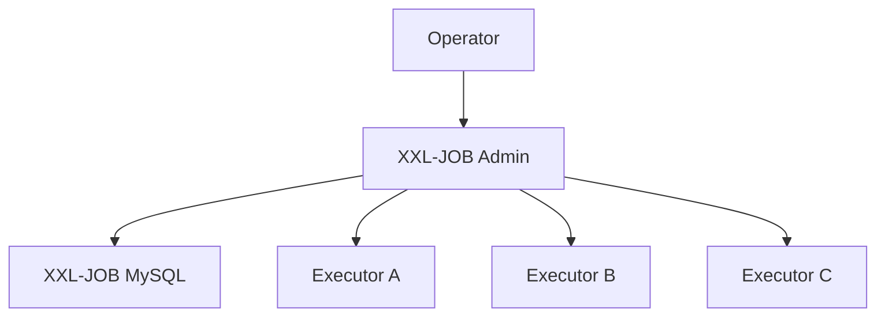

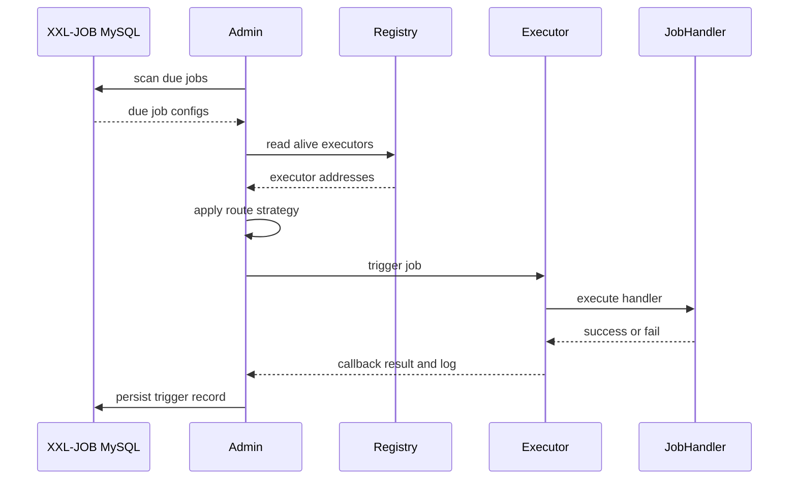

运行原理：
1.通过yaml文件进行调度器、执行器、数据库连接的配置，Admin的registry管理所有连接的executor组
2.Admin将job配置保存到数据库，比如corn、所属执行器分组、jobHandler、路由策略、阻塞策略、超时/重试设置
3.Admin内部的调度线程周期性扫描数据库中到点的job，根据job配置（执行器组、路由策略、jobHandler等），向registry获取一个或多个executor的地址，然后发起任务请求
4.Executor收到请求后找到对应的JobHandler，把任务放到本地执行线程执行，记录结果并回传Admin

使用方式：
1.调度中心 下载官网提供的xxl-job-master，运行它提供的sql文件，运行xxl-job-master源码，修改配置文件，运行程序即可
2.执行器 在自己的项目中引入xxl-job-core依赖，配置yml文件，创建一个XxlJObSpringExecutor Bean
3.JobHandler 在需要定时任务的地方通过@XxlJob声明一个执行策略

路由原理：
executor 启动后，按 appname 周期性向 admin 注册自己的地址 -> admin 维护这个执行器组的地址列表 -> 当一个任务触发时，admin 根据任务绑定的执行器组和路由策略（第一个/最后一个/轮询/随机/LRU/分片广播），从地址列表里选一或多台 -> admin 通过 HTTP/RPC 把任务触发到这台 executor

负载均衡：
有两个层面的负载均衡，第一种是路由策略为轮询，任务第一次触发会发往第一个执行器，第二次触发会发往第二个执行器；第二种是路由策略为分片广播，任务触发时会把任务发给所有执行器，同时附带一个分片总数和分片索引，业务层可以通过XXLJobHelper.getShardTotal()/getShardIndex()获取这两个值，根据索引实现单个任务的拆分，比如有一个任务是读取数据库某张表的数据，那可以在JobHandler的Mapper中写select * from user where mod(id,#{shardingTotal})=#{shardingIndex}，然后所有的JObHandler就可以并行处理自己的那部分数据了

xxl-job实现当前功能时，有一张由admin使用的周期任务配置表，声明了周期、路由策略、执行器组等，executor负责执行业务，它可以有自己的业务表、自己的处理逻辑、也可以在它里面调用其他的服务去完成业务。admin根据配置表每隔一个周期调度executor，executor去执行业务，这次调度和执行就是XXL-JOB认为的任务，Admin管这个调度有没有成功，而具体业务的操作由executor来执行，假设这次业务包含了许多个小的job，可以使用分片广播路由策略让不同的executor各自处理一部分的job，executor需要处理每一个小job的执行/失败/重试等机制。因此，xxl-job是一个通用的调度实现，它声明了一套中心调度+执行器的规则，将对executor的调度视为任务周期性的执行。不过调度的周期不太好定，太短浪费资源，太长堆积任务。

区别：
**1.任务模型：XXL-JOB 适合“平台级周期任务”，当前项目适合“用户提交的单条预约任务按指定时间触发”**， XXL-JOB 不是“不能让用户自定义时间”，而是它只支持在调度中心里给任务配置触发方式和时间，即先定义一个“调度任务模板”，再由调度中心按配置去触发它，而当前项目针对用户的每一条预约都可以指定时间，拥有非常高的用户自主性
2.执行时间精度：XXL-JOB 如果要像当前项目一样预约加载近未来任务，那就需要把预约相关字段放到业务表中，有点混合了，而且这样做了之后，也需要使用redis ZSet取出真正可执行任务，再自行对业务进行执行/失败/重试等机制。即XXL-JOB 是“调度外壳”，路由是exectuor级别的，而当前项目是“预约任务调度内核”，路由是job级别的。

**当前项目针对当前业务场景深度定制的调度运行时，可深度改造/定制的内嵌调度内核，是“运行时内核”**，聚焦在每一个小的job上，用户可以为每一个小的job自定义预约时间，有相当高的自主性和精确性，

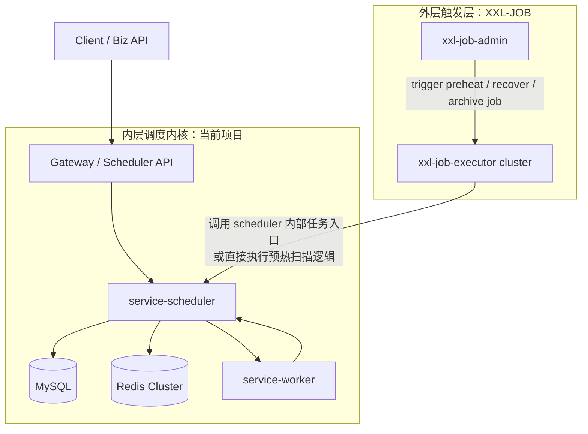

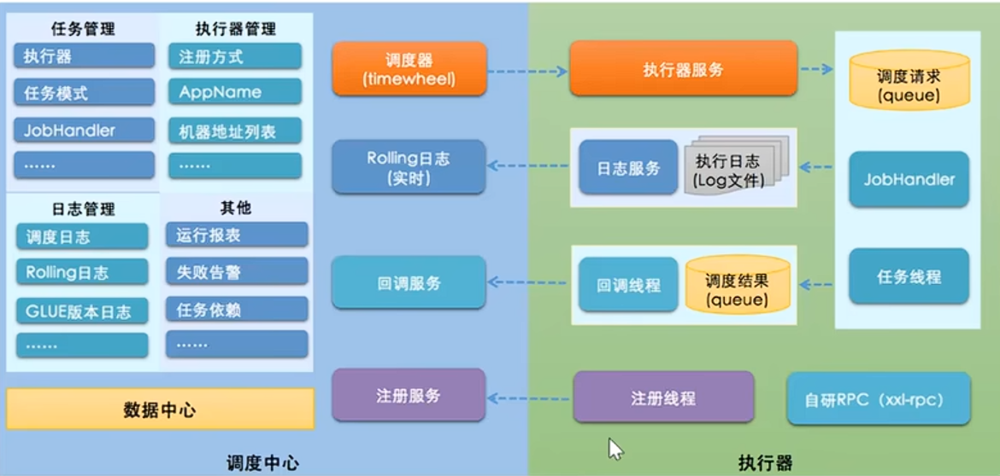

适合场景：围绕“近未来任务爆发”做热路径优化，按你自己的 nodeCode / currentLoad / maxLoad / shardKey 做精细调度。适合超热点预约定时长任务。
比如所有用户都预约在明天早上八点进行股票的一连串长任务操作，或景区预约、秒杀预约、抢票、抢展览名额这类业务。
创建任务会在短时间内突增、大量任务的执行时间集中在某几个时间窗、同一时间到期的任务很多、执行结果会反过来影响业务资源状态。
因此要求能不能避免高峰期持续扫 MySQL 、能不能让多个调度实例并行工作、能不能快速把任务派给较空闲的 worker 、能不能在任务失败、超时、回调丢失时快速恢复。

性能：理论上限更高，不是“所有任务都堆在一个中心调度器里扫描”，近未来任务预热到 Redis Redis 中的任务再按 shard 分散到多个热队列 ，多个 scheduler 只扫描自己持有的 shard scheduler ，批量为任务预留 worker 执行容量，再把任务派给 worker 异步执行

- 冷热分层，避免高峰期持续扫 MySQL
- 不是单队列抢任务，而是显式 shard 并行，比“单逻辑队列 + 多 worker 抢任务”更容易横向扩展
- worker 不是盲派，而是看实时负载。对高峰预约来说，这一点很重要，因为热点时段常见的不是“没有机器”，而是“少数机器先被打满”。
- 批量 reserve，减少每条任务一次远程选点
- 调度状态机和业务状态机可以深度联动。这一点在通用调度平台里反而不容易做到，任务状态和业务状态是强耦合设计的，可以进行深度定制

性能拼接在于：shard 分布不均、某几个 shard 的 `ready/inflight/detail` 特别热、scheduler 到 worker 的派发链路、回调/恢复/归档等旁路逻辑、Redis 故障切换与一致性处理

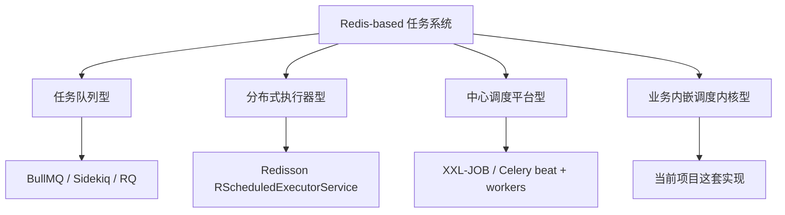

任务队列：这一步类似于当前用ZSet来实现找到“近未来任务”中真正可执行的任务。重点是把任务放进队列、到时间转成可消费任务、由 worker 消费执行

分布式执行器：这一步类似于当前项目中将可执行任务派发给线程池。Redis 里存任务和结果，任务先进入 Redisson 管理的 Redis 队列，多个 worker 注册到同一个 executor service，worker 以竞争消费者的方式去 poll 队列。但在集群中部署时，一个key对应一条队列，若将任务全部丢到同个队列里，那无法利用多redis并行执行，除非也对key进行shard {}。

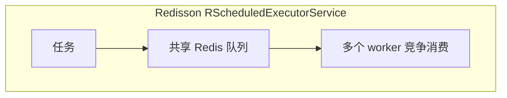

中心调度平台：更强调中心控制面和统一任务管理

业务内嵌调度内核型：worker 选点和业务负载控制直接相关，shard、claim、recover 都要服务于业务正确性，调度状态要和业务状态机联动
